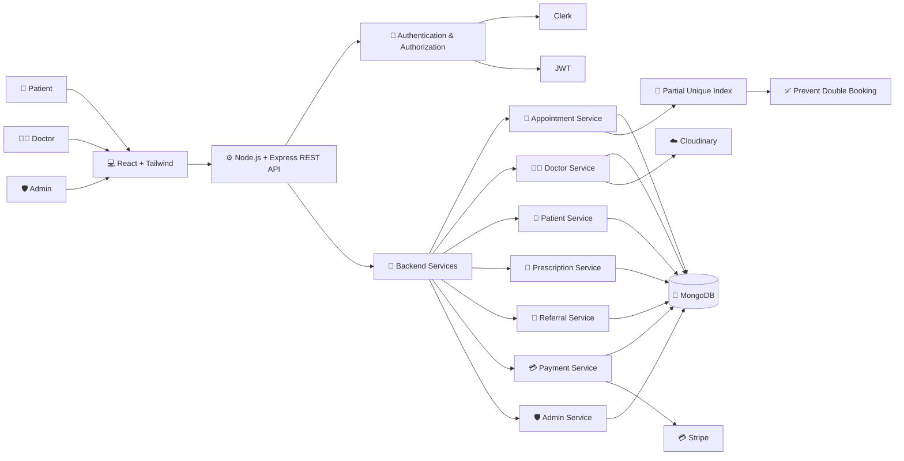

# 🏥 HealBook — Healthcare & Doctor Appointment Platform

<p align="center">
  <b>A full-stack healthcare platform connecting patients, doctors, and administrators in one secure digital ecosystem.</b>
</p>

<p align="center">
  
  
  
  
  
  
</p>

---

## 📌 Overview

**HealBook** is a full-stack healthcare and doctor appointment management platform built using the **MERN stack**.

The platform provides separate experiences for **patients, doctors, and administrators**, allowing patients to discover doctors and book appointments, while doctors can manage appointments, maintain patient records, create prescriptions, and refer patients to other specialists.

The goal of HealBook is to reduce the dependency on physical paperwork and provide patients with a **centralized digital medical record** that can be accessed whenever required.

### 🎯 Core Objectives

* Simplify doctor discovery and appointment booking.
* Digitize patient medical records and prescriptions.
* Allow doctors to maintain patient consultation history.
* Enable doctors to refer patients to other specialists.
* Reduce dependency on physical medical documents.
* Provide administrators with centralized system management.
* Maintain secure role-based access to healthcare information.

---

# 🌐 Live Deployments

| Application                   | Live URL                                                         | Platform |
| :---------------------------- | :--------------------------------------------------------------- | :------- |
| 🌐 **Patient Application**    | [HealBook Patient App](https://heal-book-frontend.vercel.app)    | Vercel   |
| 🛡️ **Admin & Doctor Portal** | [HealBook Admin Portal](https://heal-book-admin-zeta.vercel.app) | Vercel   |
| ⚙️ **Backend REST API**       | [HealBook Backend](https://healbook-backend.onrender.com)        | Render   |


---
# 📸 Screenshots

## 📸 Project Preview

<table>
  <tr>
    <td align="center" width="50%">
      
      <br><b>Patient Dashboard</b>
    </td>
    <td align="center" width="50%">
      
      <br><b>Medical Services</b>
    </td>
  </tr>

  <tr>
    <td align="center" width="50%">
      
      <br><b>Doctor Profile</b>
    </td>
    <td align="center" width="50%">
      
      <br><b>Doctor Dashboard</b>
    </td>
  </tr>

  <tr>
    <td align="center" width="50%">
      
      <br><b>Doctor Referral</b>
    </td>
    <td align="center" width="50%">
    
    <br><b>Patient Medical History</b>
  </td>
  </tr>
</table>

# 🌟 Features

## 👤 Patient Features

### 🔎 Doctor Discovery

* Search doctors by:

  * Name
  * Specialization
  * Location
  * Consultation fee
* View detailed doctor profiles.
* Check doctor availability.
* View qualifications, experience, biography, and consultation details.

### 📅 Online Appointment Booking

* Browse available consultation dates.
* Select available time slots.
* Book appointments online.
* View appointment status.
* Track upcoming and previous appointments.

### 💳 Online Payments

* Integrated payment workflow for consultations.
* Secure payment processing.
* Appointment and payment information linked together.

### 📋 Digital Medical History

Patients can access their previous medical information from their account.

Instead of carrying physical medical files from one hospital or doctor to another, patients can:

* View previous consultations.
* View medical history.
* View prescriptions issued by doctors.
* Keep important medical information available for future consultations.
* Refer to previous prescriptions when consulting another doctor.

> **Goal:** Reduce the need to carry physical medical documents while keeping important healthcare information available digitally.

---

# 👨‍⚕️ Doctor Dashboard

## 📅 Appointment Management

Doctors can:

* View upcoming appointments.
* View confirmed appointments.
* View completed appointments.
* View cancelled appointments.
* Manage their consultation schedule.
* Add, update, or remove available time slots.

## 👤 Patient Information

Doctors can access relevant patient information associated with their appointments.

This allows doctors to understand the patient's previous consultations and make better-informed decisions during follow-up visits.

## 📋 Patient Medical History

Doctors can view a patient's previous medical history available through the platform.

This helps doctors:

* Understand previous consultations.
* Review previous prescriptions.
* Track the patient's treatment history.
* Avoid repeatedly asking for information already recorded.

## 💊 Digital Prescriptions

After a consultation, doctors can create and provide a digital prescription for the patient.

The prescription can become part of the patient's digital medical history.

### Benefits

* No dependency on physical prescription copies.
* Patients can access prescriptions later.
* Previous prescriptions remain available for future consultations.
* Doctors can refer to previous treatment information when required.

## 🔄 Patient Referral

Doctors can **refer patients to another doctor or specialist** when additional expertise is required.

The referral workflow can contain relevant information such as:

* Patient information
* Referring doctor
* Referred specialist
* Reason for referral
* Clinical notes
* Referral status

This creates a connected workflow between different healthcare professionals instead of requiring patients to manually carry referral documents.

## 👨‍⚕️ Doctor Profile Management

Doctors can manage:

* Profile information
* Specialization
* Qualifications
* Experience
* Biography
* Consultation fee
* Profile image
* Availability

Profile images are managed using **Cloudinary**.

## 📊 Doctor Dashboard Analytics

Doctors can view useful dashboard metrics such as:

* Total appointments
* Completed consultations
* Upcoming appointments
* Patients treated
* Consultation earnings
* Patient feedback/ratings

---

# 🛡️ Admin & Superadmin Portal

The administration portal provides centralized management of the healthcare platform.

### 📊 System Analytics

Administrators can monitor:

* Appointment statistics
* Doctor statistics
* Department distribution
* Service information
* System-level metrics

### 👨‍⚕️ Doctor Management

Administrators can:

* Add doctors.
* Update doctor information.
* View doctors.
* Delete doctor profiles.
* Manage doctor information.

Superadmin-level functionality can provide elevated administrative operations.

### 🏥 Department & Service Management

Administrators can:

* Create departments.
* Update departments.
* Manage medical services.
* Assign department heads.
* Update service information.

### 📝 Audit & Activity Monitoring

The system maintains activity information to help administrators monitor important platform operations and security-related events.

> **Note:** Patient medical information is not provided as a general data-export feature from the admin portal.

---

# 🏗️ System Architecture

The following architecture represents the major components and data flow within HealBook.



## 🔄 High-Level Request Flow

```text
Patient / Doctor / Admin
          │
          ▼
   React Frontend
          │
          ▼
   Express REST API
          │
          ├── Authentication
          │      ├── Clerk
          │      └── JWT
          │
          ▼
   Backend Services
          │
          ├── Appointment
          ├── Doctor
          ├── Patient
          ├── Prescription
          ├── Referral
          ├── Payment
          └── Administration
          │
          ▼
       MongoDB
```

### 🔐 Appointment Double-Booking Prevention

HealBook uses a **database-level partial unique index** to prevent two active appointments from occupying the same doctor, date, and time slot.

Conceptually:

```text
Doctor + Date + Time
        │
        ▼
  Partial Unique Index
        │
        ▼
Prevent Duplicate Active Appointment
```

This provides an additional layer of protection against race conditions during simultaneous booking requests.

---

# 🛠️ Technology Stack

| Layer                  | Technologies                                |
| :--------------------- | :------------------------------------------ |
| **Frontend**           | React 19, Vite, Tailwind CSS v4             |
| **Routing**            | React Router DOM                            |
| **UI & Icons**         | Lucide Icons, React Toastify                |
| **Admin Dashboard**    | React, Vite, Tailwind CSS, Recharts         |
| **Backend**            | Node.js, Express.js                         |
| **Database**           | MongoDB Atlas, Mongoose                     |
| **Authentication**     | Clerk, JWT                                  |
| **Authorization**      | Role-based access control                   |
| **File/Image Storage** | Cloudinary                                  |
| **Payments**           | Stripe                                      |
| **Security**           | Helmet, CORS, Rate Limiting, Mongo Sanitize |
| **Password Security**  | BcryptJS                                    |
| **Validation**         | Express Validator                           |
| **Deployment**         | Vercel, Render                              |

---

# 🧩 Application Roles

HealBook follows a role-based architecture.

```text
                    HealBook
                       │
          ┌────────────┼────────────┐
          │            │            │
          ▼            ▼            ▼
       Patient       Doctor       Admin
          │            │            │
          │            │            │
      Book Slots   Manage Slots   Manage System
      View History Appointments    Doctors
      View Rx      Patient Data   Departments
      Appointments Prescriptions  Services
                   Referrals      Analytics
```

### 👤 Patient

* Search doctors
* Book appointments
* Make payments
* View appointments
* View medical history
* View prescriptions

### 👨‍⚕️ Doctor

* Manage profile
* Manage availability
* Manage appointments
* View patient information
* View patient history
* Create prescriptions
* Refer patients to specialists

### 🛡️ Admin

* Manage doctors
* Manage departments
* Manage services
* Monitor system activity
* View system analytics

---

# 📁 Repository Structure

```text
HealBook/
│
├── backend/                         # Express.js REST API
│   ├── config/
│   │   ├── db.js                    # MongoDB configuration
│   │   └── cloudinary.js            # Cloudinary configuration
│   │
│   ├── controllers/                 # Business logic
│   │   ├── doctorController.js
│   │   ├── adminController.js
│   │   ├── appointmentController.js
│   │   ├── prescriptionController.js
│   │   └── referralController.js
│   │
│   ├── middleware/                  # Authentication & security
│   │   ├── auth.js
│   │   ├── roleAuthorization.js
│   │   ├── rateLimiter.js
│   │   └── upload.js
│   │
│   ├── models/                      # MongoDB/Mongoose models
│   │   ├── Doctor.js
│   │   ├── User.js
│   │   ├── Appointment.js
│   │   ├── Prescription.js
│   │   ├── Referral.js
│   │   └── Service.js
│   │
│   ├── routes/                      # REST API routes
│   ├── uploads/                     # Temporary uploads
│   ├── server.js                    # Backend entry point
│   ├── .env                         # Environment variables
│   └── package.json
│
├── frontend/                        # Patient web application
│   ├── src/
│   │   ├── assets/
│   │   ├── components/
│   │   ├── pages/
│   │   ├── doctor/
│   │   └── App.jsx
│   ├── index.html
│   └── package.json
│
└── admin/                           # Admin & Doctor portal
    ├── src/
    │   ├── components/
    │   ├── context/
    │   └── App.jsx
    ├── index.html
    └── package.json
```

---

# 🔌 API Endpoints

| Method   | Endpoint                | Access        | Description                         |
| :------- | :---------------------- | :------------ | :---------------------------------- |
| `GET`    | `/api/doctors`          | Public        | Fetch doctors with search/filtering |
| `GET`    | `/api/doctors/:id`      | Public        | Get doctor details                  |
| `POST`   | `/api/doctors`          | Admin         | Create doctor                       |
| `PUT`    | `/api/doctors/:id`      | Doctor/Admin  | Update doctor                       |
| `DELETE` | `/api/doctors/:id`      | Admin         | Delete doctor                       |
| `GET`    | `/api/doctor/dashboard` | Doctor        | Doctor dashboard metrics            |
| `GET`    | `/api/doctor/profile`   | Doctor        | Get doctor profile                  |
| `PUT`    | `/api/doctor/profile`   | Doctor        | Update doctor profile               |
| `GET`    | `/api/appointments`     | Authenticated | Get appointments                    |
| `POST`   | `/api/appointments`     | Patient       | Book appointment                    |
| `GET`    | `/api/services`         | Public        | List medical services               |
| `GET`    | `/api/departments`      | Public        | List departments                    |
| `GET`    | `/api/admin/dashboard`  | Admin         | System analytics                    |

> Additional prescription, referral, and patient-history endpoints can be added to the API as these modules evolve.

---

# 🔒 Security Practices

HealBook applies multiple security practices to protect the application and user data.

### 🛡️ Authentication

* Clerk authentication for supported user flows.
* JWT-based authentication for protected backend operations.
* Protected routes for authenticated users.

### 👮 Role-Based Authorization

Different roles have different permissions:

```text
Patient ──► Patient resources
Doctor  ──► Doctor + assigned patient resources
Admin   ──► Administrative resources
```

### 🚦 Rate Limiting

API endpoints are protected using request rate limiting to reduce abuse and excessive requests.

### 🧹 Input Sanitization

MongoDB input is sanitized using `express-mongo-sanitize` to reduce NoSQL injection risks.

### 🪖 HTTP Security Headers

`Helmet` is used to configure common HTTP security headers.

### ☁️ Secure File Storage

Uploaded images are processed through Multer and stored using Cloudinary over HTTPS.

### 🔐 Environment Variables

Sensitive credentials and API keys are stored in environment variables rather than hardcoded into application code.

**Never commit `.env` files or secret API keys to GitHub.**

---

# ⚙️ Environment Configuration

Create a `.env` file inside the `backend` directory.

```env
PORT=4000

MONGO_URI=your_mongodb_connection_string

JWT_SECRET=your_jwt_secret

# Cloudinary
CLOUDINARY_CLOUD_NAME=your_cloudinary_cloud_name
CLOUDINARY_API_KEY=your_cloudinary_api_key
CLOUDINARY_API_SECRET=your_cloudinary_api_secret

# Stripe
STRIPE_SECRET_KEY=your_stripe_secret_key

# Frontend
FRONTEND_URL=http://localhost:5173

# Clerk
CLERK_SECRET_KEY=your_clerk_secret_key
```

A `.env.example` file should be provided as a reference.

---

# 🚀 Getting Started

## Prerequisites

Make sure the following are installed:

* **Node.js** v18+
* **npm** v9+
* **MongoDB Atlas** or local MongoDB
* Git

---

## 1️⃣ Clone the Repository

```bash
git clone https://github.com/your-username/healbook.git

cd healbook
```

---

## 2️⃣ Install Backend Dependencies

```bash
cd backend

npm install
```

---

## 3️⃣ Install Frontend Dependencies

```bash
cd ../frontend

npm install
```

---

## 4️⃣ Install Admin Dependencies

```bash
cd ../admin

npm install
```

---

# ▶️ Running the Application

Run each application in a separate terminal.

### Terminal 1 — Backend

```bash
cd backend

npm run dev
```

Backend:

```text
http://localhost:4000
```

### Terminal 2 — Patient Application

```bash
cd frontend

npm run dev
```

Frontend:

```text
http://localhost:5173
```

### Terminal 3 — Admin & Doctor Portal

```bash
cd admin

npm run dev
```

Admin/Doctor portal:

```text
http://localhost:5174
```

---

# 🔄 Core Healthcare Workflow

## Patient Appointment Workflow

```text
Search Doctor
     │
     ▼
View Doctor Profile
     │
     ▼
Select Date & Time
     │
     ▼
Book Appointment
     │
     ▼
Payment
     │
     ▼
Doctor Consultation
     │
     ▼
Prescription / Referral
     │
     ▼
Medical History Updated
     │
     ▼
Patient Can Access Records Later
```

## Doctor Consultation Workflow

```text
Doctor receives appointment
          │
          ▼
     View Patient
          │
          ▼
View Previous History
          │
          ▼
     Consultation
          │
     ┌────┴────┐
     ▼         ▼
Prescription  Referral
     │         │
     └────┬────┘
          ▼
Patient Medical Record Updated
```

---

# 🗃️ Digital Medical Records

One of the key goals of HealBook is to move important healthcare information from paper-based workflows to a centralized digital system.

### Patient can access:

* Previous medical history
* Previous consultations
* Digital prescriptions
* Appointment history

### Doctor can access:

* Relevant patient history
* Previous prescriptions
* Previous consultations
* Appointment information

### Why this matters

Traditional healthcare workflows often require patients to carry:

```text
📄 Old Prescriptions
📄 Medical Reports
📄 Referral Letters
📄 Previous Consultation Records
```

HealBook aims to provide a centralized digital experience:

```text
             🏥 HealBook
                  │
        ┌─────────┴─────────┐
        ▼                   ▼
   Patient Records      Doctor Records
        │                   │
        ├── History         ├── History
        ├── Prescriptions   ├── Prescriptions
        ├── Appointments    └── Referrals
        └── Consultations
```

This makes important records easier to access during future consultations.

---

# 🚀 Future Roadmap

HealBook is designed to evolve into a more complete digital healthcare ecosystem.

### 🎥 1. Video Consultation

Enable patients to consult doctors remotely using secure video calls.

Planned capabilities:

* Doctor-patient video calls
* Appointment-based consultation rooms
* Waiting room
* Consultation status
* Secure session handling

---

### 📱 2. Mobile Application

Develop dedicated Android/iOS applications for:

* Patients
* Doctors

This would provide easier access to appointments, prescriptions, and medical records.

---

### 🔔 3. Notifications & Reminders

Introduce automated notifications for:

* Appointment confirmations
* Upcoming appointments
* Appointment cancellations
* Prescription updates
* Referral updates

Potential channels:

* Email
* Push notifications
* SMS

---

### 🔄 4. Referral Tracking

Expand the referral system so patients and doctors can track:

```text
Referral Created
      ↓
Referral Sent
      ↓
Specialist Accepts
      ↓
Consultation
      ↓
Referral Completed
```

---

### 💊 5. Prescription Enhancements

Future versions can support:

* Structured medication details
* Dosage and duration
* Prescription history
* Follow-up reminders
* Digital prescription viewing

---

### 🧾 6. Complete Electronic Health Record

Expand the medical-history system into a more comprehensive digital health record containing:

* Consultation history
* Prescriptions
* Referrals
* Medical reports
* Allergies
* Previous treatments
* Relevant patient information

---

### 🏥 7. Multi-Hospital / Clinic Support

Allow multiple clinics or hospitals to use the platform while maintaining proper role-based access between organizations.

---

### 🤖 8. Healthcare Automation

Future versions may introduce carefully controlled automation for administrative workflows such as:

* Appointment scheduling assistance
* Follow-up reminders
* Prescription notifications
* Patient communication
* Administrative task automation

---

### 📈 9. Advanced Analytics

Future analytics could provide authorized administrators with insights such as:

* Appointment trends
* Doctor utilization
* Department demand
* Patient appointment patterns
* Operational metrics

---

# 💡 Key Engineering Highlights

The project demonstrates practical implementation of several full-stack concepts:

* RESTful API architecture
* MERN stack development
* Role-based authorization
* Authentication using Clerk and JWT
* MongoDB data modeling
* Appointment scheduling
* Database-level duplicate booking prevention
* Partial unique indexes
* Payment integration
* Cloudinary image storage
* Secure API middleware
* Rate limiting
* Input sanitization
* Responsive React UI
* Admin dashboard analytics
* Digital prescriptions
* Patient medical history
* Doctor-to-doctor referral workflow

---

# 🧠 Design Principles

### 1. Security First

Healthcare-related information should only be accessible to authorized users.

### 2. Role-Based Access

Patients, doctors, and administrators have different responsibilities and permissions.

### 3. Database-Level Consistency

Important constraints such as appointment uniqueness should not rely only on frontend validation.

### 4. Modular Architecture

Backend services are separated into controllers, models, routes, and middleware to keep the application maintainable.

### 5. Patient-Centric Experience

The platform focuses on reducing friction around:

* Finding doctors
* Booking appointments
* Accessing previous records
* Managing prescriptions
* Following referrals

---

# 🤝 Project Structure & Contribution

HealBook follows a modular full-stack architecture so individual modules can be developed and maintained independently.

```text
Frontend
   │
   ▼
REST API
   │
   ▼
Controllers
   │
   ▼
Services / Business Logic
   │
   ▼
Mongoose Models
   │
   ▼
MongoDB
```

---


<p align="center">
  <b>🏥 HealBook — Making healthcare management more connected, accessible, and digital.</b>
</p>
